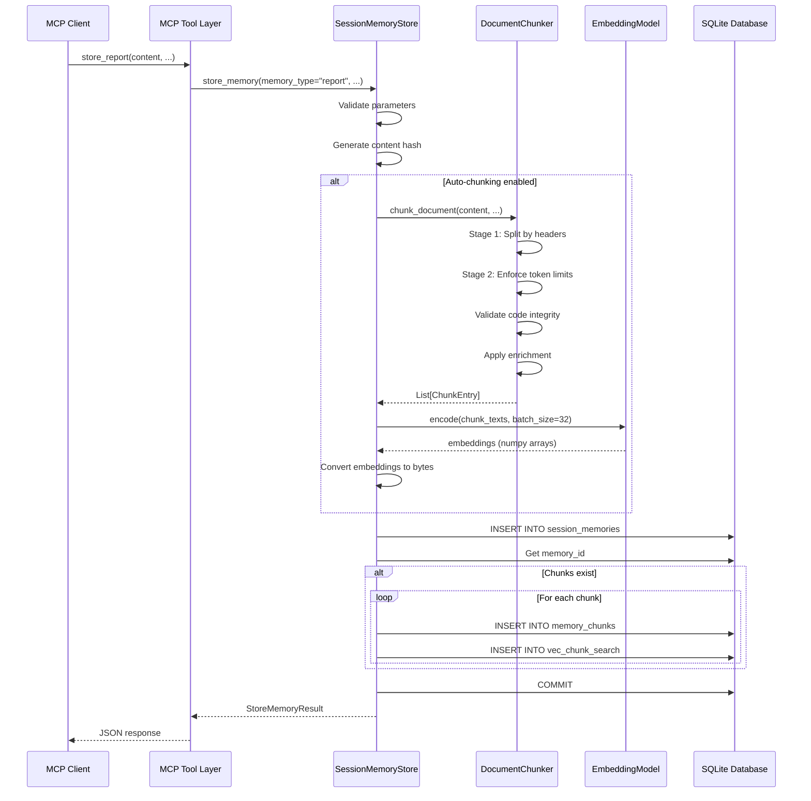
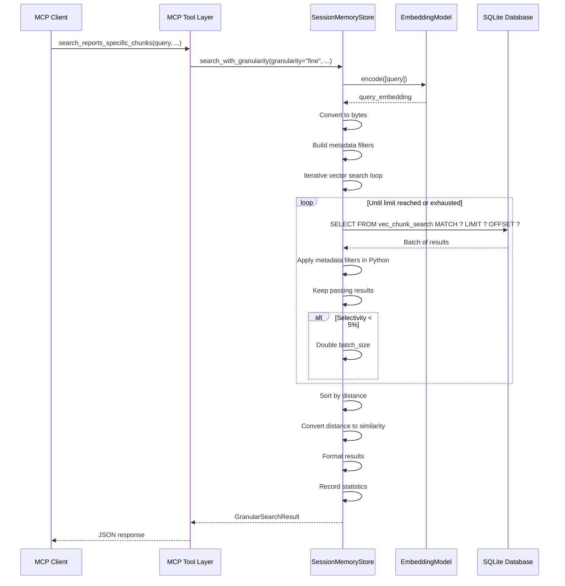

# Vector Memory MCP - System Architecture

**Version:** 1.0.0
**Implementation:** `/Users/vladanm/projects/vector-memory-mcp/vector-memory-2-mcp/`
**Protocol:** Model Context Protocol (MCP) over STDIO
**Language:** Python 3.11+

---

## Table of Contents

1. [System Overview](#system-overview)
2. [Component Architecture](#component-architecture)
3. [Data Flow](#data-flow)
4. [Integration Patterns](#integration-patterns)
5. [Performance Model](#performance-model)
6. [Security & Privacy](#security--privacy)
7. [Deployment Guide](#deployment-guide)
8. [Best Practices](#best-practices)
9. [Troubleshooting](#troubleshooting)

---

## System Overview

### High-Level Architecture

```
┌──────────────────────────────────────────────────────────────────┐
│                         MCP Client                                │
│                    (Claude Code / IDE)                            │
└────────────────┬─────────────────────────────────────────────────┘
                 │ MCP Protocol (JSON-RPC over STDIO)
                 ▼
┌─────────────────────────────────────────────────────────────────┐
│                    MCP Server (FastMCP)                          │
│  ┌────────────────────────────────────────────────────────────┐ │
│  │                    MCP Tool Layer                          │ │
│  │  - store_*() tools                                        │ │
│  │  - search_*() tools                                       │ │
│  │  - utility tools                                          │ │
│  └────────────┬───────────────────────────────────────────────┘ │
│               │                                                  │
│  ┌────────────▼───────────────────────────────────────────────┐ │
│  │           SessionMemoryStore (Core Logic)                  │ │
│  │  - Storage operations                                     │ │
│  │  - Search operations                                      │ │
│  │  - Maintenance operations                                 │ │
│  └────────────┬───────────────────────────────────────────────┘ │
│               │                                                  │
│  ┌────────────▼──────────┬─────────────────────────────────────┐ │
│  │   DocumentChunker     │   EmbeddingModel                   │ │
│  │   (LangChain)         │   (SentenceTransformers)           │ │
│  └───────────────────────┴─────────────────────────────────────┘ │
└────────────────┬─────────────────────────────────────────────────┘
                 │
                 ▼
┌─────────────────────────────────────────────────────────────────┐
│                 SQLite Database with sqlite-vec                  │
│  ┌──────────────────────┬─────────────────────────────────────┐ │
│  │  session_memories    │  memory_chunks                      │ │
│  │  (Documents)         │  (Chunks)                           │ │
│  └──────────────────────┴─────────────────────────────────────┘ │
│  ┌──────────────────────────────────────────────────────────┐  │
│  │  vec_chunk_search (Vector Index)                         │  │
│  │  - k-NN search via sqlite-vec                            │  │
│  └──────────────────────────────────────────────────────────┘  │
└─────────────────────────────────────────────────────────────────┘
```

### Key Characteristics

| Aspect | Details |
|--------|---------|
| **Architecture Style** | Layered monolith |
| **Communication** | Synchronous (MCP over STDIO) |
| **Storage** | Single-file SQLite database |
| **Search** | Vector similarity + metadata filtering |
| **Scalability** | Single process, file-based (100k+ memories) |
| **Deployment** | Embedded in client process |

---

## Component Architecture

### 1. MCP Tool Layer

**Location:** `main.py` (lines 164-741)

**Responsibilities:**
- Expose MCP tools via FastMCP decorators
- Parameter validation and type conversion
- Result formatting (StoreMemoryResult, SearchMemoriesResult, etc.)
- Error handling and logging

**Design Pattern:** Facade pattern (thin wrapper over core logic)

**Example:**
```python
@mcp.tool()
def store_report(
    agent_id: str,
    session_id: str,
    content: str,
    session_iter: str | None = None,
    task_code: str | None = None
) -> StoreMemoryResult:
    """Store agent report memory."""
    result = store.store_memory(
        agent_id=agent_id,
        memory_type="report",
        content=content,
        session_id=session_id,
        session_iter=session_iter,
        task_code=task_code,
        metadata={"scope": "report"}
    )
    return result
```

---

### 2. SessionMemoryStore (Core Logic)

**Location:** `src/session_memory_store.py`

**Responsibilities:**
- Storage lifecycle management
- Search orchestration
- Chunking coordination
- Embedding generation
- Performance monitoring

**Sub-modules:**
- **StorageOperations** (`src/storage.py`): CRUD operations
- **SearchOperations** (`src/search.py`): All search granularities
- **MaintenanceOperations** (`src/maintenance.py`): Cleanup, stats
- **ChunkingStorageOperations** (`src/chunking_storage.py`): Chunk context operations

**Design Pattern:** Facade + Delegation

**Initialization:**
```python
class SessionMemoryStore:
    def __init__(self, db_path: str):
        self.db_path = db_path
        self._init_schema()
        self._chunker = None  # Lazy load
        self._embedding_model = None  # Lazy load
        self.search_stats = SearchStatistics()

        # Initialize operation modules
        self.storage = StorageOperations(self)
        self.search = SearchOperations(self)
        self.maintenance = MaintenanceOperations(self)
        self.chunking = ChunkingStorageOperations(self)
```

---

### 3. DocumentChunker

**Location:** `src/chunking.py`

**Responsibilities:**
- Two-stage markdown chunking
- Header hierarchy parsing
- Code block integrity validation
- Contextual enrichment
- Token counting

**Dependencies:**
- LangChain: MarkdownHeaderTextSplitter, RecursiveCharacterTextSplitter
- tiktoken: Token counting (cl100k_base encoding)

**Algorithm:**
```
Stage 1: ExperimentalMarkdownSyntaxTextSplitter
  ↓ (Split by headers, preserve code blocks)
Stage 2: RecursiveCharacterTextSplitter
  ↓ (Enforce token limits, code-aware separators)
Validation: Code fence balance check
  ↓
Enrichment: Add document/section context
  ↓
Output: List[ChunkEntry]
```

---

### 4. Embedding Model

**Model:** sentence-transformers/all-MiniLM-L6-v2
**Dimensions:** 384
**Device:** CPU (default)
**Inference:** Batch processing (batch_size=32)

**Lazy Loading:**
```python
@property
def embedding_model(self):
    if self._embedding_model is None:
        from sentence_transformers import SentenceTransformer
        self._embedding_model = SentenceTransformer(
            'all-MiniLM-L6-v2',
            device='cpu'
        )
    return self._embedding_model
```

**Warmup (Startup):**
```python
# CRITICAL: Load model BEFORE starting MCP server
# Prevents timeout on first call (5-7s load time)
with suppress_stdout_stderr():
    _ = store.embedding_model.encode(
        ["Warmup text"],
        show_progress_bar=False
    )
```

---

### 5. Database Layer

**SQLite Configuration:**
```sql
PRAGMA journal_mode=WAL;        -- Better concurrency
PRAGMA synchronous=NORMAL;      -- Faster writes (safe with WAL)
PRAGMA busy_timeout=30000;      -- 30s lock timeout
PRAGMA foreign_keys=ON;         -- Enforce referential integrity
```

**sqlite-vec Extension:**
- Loaded at runtime via `sqlite_vec.load(conn)`
- Provides `vec0()` virtual table for vector search
- L2 distance metric for k-NN search

**Connection Pooling:**
- New connection per operation (stateless)
- Connection reuse via context managers
- Automatic cleanup on close

---

## Data Flow

### Storage Flow (store_report)



**Critical Path:**
1. Validate inputs (< 1ms)
2. Chunk document (50-200ms for 5k tokens)
3. Generate embeddings (1-2s for 12 chunks)
4. Database writes (100-500ms)

**Total:** 1.5-3 seconds for typical report

---

### Search Flow (search_reports_specific_chunks - FINE)



**Critical Path:**
1. Generate query embedding (100-200ms)
2. Iterative vector search (200-1000ms depending on selectivity)
3. Format results (< 10ms)

**Total:** 300-1200ms typical

---

## Integration Patterns

### Pattern 1: Embedded MCP Server

**Use Case:** Development, local testing

```bash
# Run server directly
python main.py --database-path /path/to/db.db

# Or with UV (recommended)
uv run main.py --database-path /path/to/db.db
```

**Configuration:** `.mcp.json`
```json
{
  "mcpServers": {
    "vector-memory": {
      "command": "uv",
      "args": [
        "run",
        "/path/to/vector-memory-mcp/main.py",
        "--database-path",
        "/absolute/path/to/memory.db"
      ],
      "env": {}
    }
  }
}
```

**Communication:** STDIO (stdin/stdout)

---

### Pattern 2: Multi-Agent System Integration

**Use Case:** Production multi-agent system

```
Main Agent (Claude Code CLI)
  ↓
  ├─→ Sub-Agent 1 (code-explorer-agent)
  │     ↓ MCP calls
  │     └─→ Vector Memory Server
  │
  ├─→ Sub-Agent 2 (jira-agent)
  │     ↓ MCP calls
  │     └─→ Vector Memory Server
  │
  └─→ Sub-Agent 3 (reporting-agent)
        ↓ MCP calls
        └─→ Vector Memory Server
```

**Key Points:**
- Single database shared by all agents
- Agent isolation via `agent_id` field
- Session isolation via `session_id` field
- No cross-agent memory leakage

---

### Pattern 3: Centralized Memory Server

**Use Case:** Multiple independent clients

```
┌───────────────┐
│ Client 1      │───┐
└───────────────┘   │
                    │
┌───────────────┐   │    ┌─────────────────────┐
│ Client 2      │───┼───→│ Vector Memory Server│
└───────────────┘   │    └─────────────────────┘
                    │              ↓
┌───────────────┐   │    ┌─────────────────────┐
│ Client 3      │───┘    │  Shared Database    │
└───────────────┘        └─────────────────────┘
```

**Configuration:**
- Single long-running server process
- HTTP transport (future enhancement)
- Authentication/authorization layer
- Rate limiting and quotas

---

## Performance Model

### Latency Breakdown

#### Storage Operation (store_report)

| Stage | Typical | Worst Case | Notes |
|-------|---------|------------|-------|
| Validation | 1ms | 5ms | Input validation |
| Chunking | 100ms | 500ms | 5k-50k tokens |
| Embedding | 1s | 5s | Batch processing |
| DB Write | 100ms | 500ms | WAL mode |
| **Total** | **1.2s** | **6s** | |

**Optimization:**
- Pre-warm embedding model at startup (eliminates 5-7s first-call penalty)
- Batch embedding generation (10-50x faster than sequential)
- WAL mode (concurrent reads during writes)

---

#### Search Operation (FINE granularity)

| Stage | Typical | Worst Case | Notes |
|-------|---------|------------|-------|
| Query Embedding | 100ms | 200ms | Single query |
| Vector Search | 200ms | 1000ms | Depends on selectivity |
| Metadata Filtering | 10ms | 100ms | Python post-filtering |
| Result Formatting | 5ms | 20ms | JSON serialization |
| **Total** | **315ms** | **1320ms** | |

**Optimization:**
- Iterative fetching (Task 2) - prevents starvation
- Adaptive batch sizing - handles low selectivity
- Index coverage - fast metadata filtering

---

### Throughput

| Operation | Throughput | Concurrency | Notes |
|-----------|------------|-------------|-------|
| Store | 1-5 ops/s | 1 (STDIO) | Embedding generation bottleneck |
| Search (FINE) | 2-10 ops/s | 1 (STDIO) | Vector search bottleneck |
| Search (COARSE) | 10-50 ops/s | 1 (STDIO) | Database scan |

**Scalability Limits:**
- **Single process:** STDIO transport limits to 1 concurrent operation
- **Embedding model:** CPU-bound (no GPU support yet)
- **Database:** WAL mode allows concurrent reads, sequential writes

---

### Memory Usage

| Component | Idle | Peak | Notes |
|-----------|------|------|-------|
| Python Process | 50 MB | 200 MB | Base overhead |
| Embedding Model | 90 MB | 90 MB | all-MiniLM-L6-v2 loaded |
| Chunker | 10 MB | 50 MB | LangChain structures |
| Database Cache | 10 MB | 100 MB | SQLite page cache |
| **Total** | **160 MB** | **440 MB** | |

**Per Operation:**
- Store: +50 MB (chunking + embeddings)
- Search: +20 MB (result set)

---

## Security & Privacy

### Data Isolation

**Agent Isolation:**
- Enforced via `agent_id` field in database
- No cross-agent queries without explicit filtering
- Each agent has isolated memory space

**Session Isolation:**
- Enforced via `session_id` field
- Sessions cannot access other sessions' data
- Session-scoped searches require explicit session_id

---

### Access Control

**Current Implementation:**
- No authentication (single-user embedded server)
- No authorization (all agents have full access to their data)
- Trust model: All agents are trusted

**Future Enhancements:**
- Agent-level permissions (read/write/delete)
- Session-level access control
- Audit logging

---

### Data Privacy

**Storage:**
- All data stored locally in SQLite file
- No external API calls (embeddings generated locally)
- No telemetry or analytics

**Embeddings:**
- Generated locally (no cloud API)
- Cannot be reverse-engineered to original text
- Dimension reduction prevents exact reconstruction

---

### Security Best Practices

1. **Database file permissions:**
   ```bash
   chmod 600 memory.db  # Owner read/write only
   ```

2. **Validate all inputs:**
   - Check memory_type against whitelist
   - Validate session_id and agent_id formats
   - Sanitize content (prevent SQL injection - using parameterized queries)

3. **Content hash verification:**
   - Prevents duplicate storage
   - Detects data corruption

4. **Foreign key constraints:**
   - Prevents orphaned chunks
   - Ensures referential integrity

---

## Deployment Guide

### Requirements

**Python:**
- Version: 3.11+
- Packages: fastmcp, mcp, sqlite-vec, sentence-transformers, tiktoken, langchain-text-splitters

**System:**
- OS: Linux, macOS, Windows
- RAM: 512 MB minimum, 2 GB recommended
- Disk: 100 MB for code, variable for database (typically 1-100 MB per session)

---

### Installation

**1. Clone repository:**
```bash
git clone <repo-url>
cd vector-memory-2-mcp
```

**2. Install dependencies:**
```bash
uv venv
source .venv/bin/activate  # On Windows: .venv\Scripts\activate
uv pip install -r requirements.txt
```

**3. Verify installation:**
```bash
python main.py --help
```

---

### Configuration

**Database path:**
```bash
# Absolute path (recommended)
python main.py --database-path /absolute/path/to/memory.db

# Relative path (working directory)
python main.py --working-dir /path/to/project
# Creates: /path/to/project/memory/agent_session_memory.db
```

**Environment variables:**
```bash
# Optional: Override embedding model
export EMBEDDING_MODEL="sentence-transformers/all-MiniLM-L6-v2"

# Optional: Enable debug logging
export LOG_LEVEL="DEBUG"
```

---

### Running the Server

**Development (MCP Inspector):**
```bash
uv run mcp dev main.py --database-path ./memory.db
```

**Production (Claude Code CLI):**
```bash
# Add to .mcp.json
{
  "mcpServers": {
    "vector-memory": {
      "command": "uv",
      "args": ["run", "/path/to/main.py", "--database-path", "/path/to/memory.db"]
    }
  }
}
```

---

### Monitoring

**Log files:**
```bash
tail -f logs/mcp_server.log
```

**Performance statistics:**
```python
# Via MCP tool
stats = store.get_search_statistics()
# Returns: P50, P95, P99 latencies, slow query rate
```

**Database statistics:**
```sql
-- Database size
SELECT page_count * page_size as size FROM pragma_page_count(), pragma_page_size();

-- Memory count
SELECT COUNT(*) FROM session_memories;

-- Chunk count
SELECT COUNT(*) FROM memory_chunks;
```

---

## Best Practices

### For Application Developers

1. **Use appropriate granularity:**
   - FINE: Specific details (< 400 tokens)
   - MEDIUM: Section context (400-1200 tokens)
   - COARSE: Full documents (> 1200 tokens)

2. **Provide sufficient metadata:**
   - Always set `session_id`, `agent_id`
   - Use `task_code` for task-level filtering
   - Add descriptive `title` and `description`

3. **Handle large documents:**
   - Enable auto-chunking for reports > 450 tokens
   - Use `write_document_to_file` for very large documents
   - Consider pagination for search results

4. **Error handling:**
   - Check `success` field in all results
   - Handle `DatabaseLockError` with retry
   - Log errors for debugging

---

### For System Integrators

1. **Database location:**
   - Use absolute paths
   - Place on fast storage (SSD)
   - Backup regularly

2. **Resource management:**
   - Pre-warm embedding model at startup
   - Monitor memory usage
   - Set `busy_timeout` appropriately

3. **Performance tuning:**
   - Adjust `VECTOR_SEARCH_BATCH_SIZE` for your workload
   - Monitor slow queries (> 2s)
   - Run VACUUM periodically

4. **Testing:**
   - Use MCP Inspector for interactive testing
   - Implement integration tests with real data
   - Load test with concurrent operations (future HTTP mode)

---

## Troubleshooting

### Issue: First memory storage takes 7+ seconds

**Cause:** Embedding model loading time

**Solution:**
```python
# Enable warm-start in config.py
WARM_START_EMBEDDING_MODEL = True

# Or manually pre-load
store.embedding_model  # Trigger lazy load
```

---

### Issue: Search returns 0 results despite data existing

**Cause:** Missing embeddings for chunks

**Solution:**
```python
# Check for missing embeddings
result = store.backfill_embeddings()
print(f"Backfilled: {result['chunks_processed']} chunks")
```

---

### Issue: "Database is locked" error

**Cause:** Concurrent write attempts or long-running transaction

**Solution:**
```python
# Increase busy timeout
PRAGMA busy_timeout=30000;  # 30 seconds

# Or use WAL mode (already enabled by default)
```

---

### Issue: Slow searches (> 2s)

**Cause:** Low selectivity filters causing many fetches

**Solution:**
```python
# Increase initial batch size
VECTOR_SEARCH_BATCH_SIZE = 500  # Default: 100

# Or reduce limit
search_reports_specific_chunks(query, limit=5)  # Instead of limit=20
```

---

### Issue: High memory usage (> 500 MB)

**Cause:** Embedding model loaded multiple times or large result sets

**Solution:**
```python
# Ensure single model instance (lazy loading)
# Check for memory leaks in long-running processes

# For large result sets:
# Use pagination or COARSE granularity with file export
write_document_to_file(memory_id, output_path)
```

---

## References

### Documentation

- **MCP Specification:** `VECTOR_MEMORY_MCP_SPECIFICATION.md`
- **Chunking Algorithm:** `VECTOR_MEMORY_CHUNKING_ALGORITHM.md`
- **Search Algorithms:** `VECTOR_MEMORY_SEARCH_ALGORITHMS.md`
- **SQL Schema:** `VECTOR_MEMORY_SQL_SCHEMA.md`

### Codebase

- **Main Server:** `main.py`
- **Core Logic:** `src/session_memory_store.py`
- **Chunking:** `src/chunking.py`
- **Search:** `src/search.py`
- **Database:** `src/db_migrations.py`

### External

- **MCP Protocol:** https://modelcontextprotocol.io
- **FastMCP:** https://github.com/modelcontextprotocol/python-sdk
- **sqlite-vec:** https://github.com/asg017/sqlite-vec
- **SentenceTransformers:** https://www.sbert.net

---

**End of Architecture Documentation**
