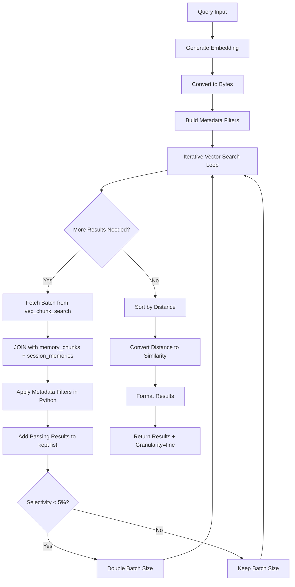
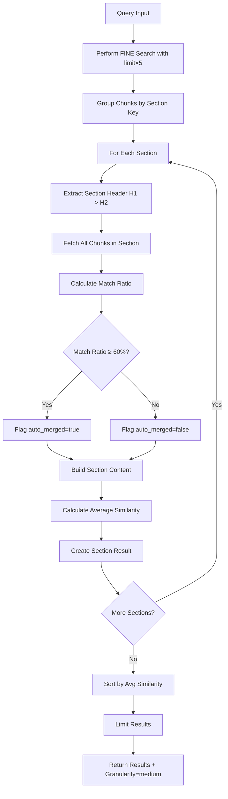
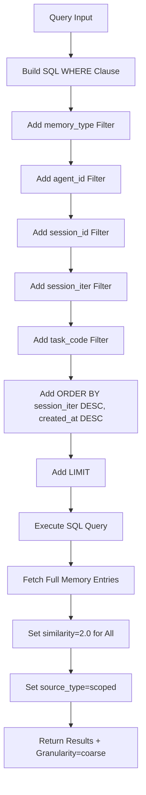

# Vector Memory Search Algorithms

**Version:** 1.0.0
**Implementation:** `/Users/vladanm/projects/vector-memory-mcp/vector-memory-2-mcp/src/session_memory_store.py`
**Vector Search:** sqlite-vec (vec0 virtual tables)
**Embedding Model:** all-MiniLM-L6-v2 (384 dimensions)

---

## Table of Contents

1. [Overview](#overview)
2. [Three Granularity Levels](#three-granularity-levels)
3. [FINE Granularity Algorithm](#fine-granularity-algorithm)
4. [MEDIUM Granularity Algorithm](#medium-granularity-algorithm)
5. [COARSE Granularity Algorithm](#coarse-granularity-algorithm)
6. [Vector Similarity Calculation](#vector-similarity-calculation)
7. [Iterative Post-Filter Fetching](#iterative-post-filter-fetching)
8. [Performance Optimization](#performance-optimization)
9. [Algorithm Flow Diagrams](#algorithm-flow-diagrams)
10. [Use Case Recommendations](#use-case-recommendations)

---

## Overview

The Vector Memory search system provides **three granularity levels** optimized for different use cases:

| Granularity | Returns | Typical Size | Use Case | Latency |
|-------------|---------|--------------|----------|---------|
| **FINE** | Individual chunks | ~400 tokens | Specific details, exact information | 200-500ms |
| **MEDIUM** | Sections with context | 400-1200 tokens | Understanding context, related findings | 500-1500ms |
| **COARSE** | Full documents | Full documents | Comprehensive overview, document structure | 50-200ms |

### Key Concepts

- **Vector Search:** Semantic similarity using embeddings (FINE, MEDIUM initial pass)
- **Scoped Search:** Metadata filtering without embeddings (COARSE)
- **Iterative Fetching:** Dynamic batch sizing for low-selectivity filters
- **Post-Filtering:** Metadata filters applied after vector search

---

## Three Granularity Levels

### Decision Tree

```
Need specific detail or exact quote? → FINE
  ↓ No
Need context around findings? → MEDIUM
  ↓ No
Need full document or overview? → COARSE
```

### Comparison Matrix

| Feature | FINE | MEDIUM | COARSE |
|---------|------|--------|--------|
| **Vector search** | Yes | Yes (initial) | No |
| **Returns** | Chunks (~400 tokens) | Sections (400-1200 tokens) | Documents (unlimited) |
| **Context** | Minimal | Expanded (±3 chunks) | Complete |
| **Auto-merge** | No | Yes (≥60% match) | N/A |
| **Similarity scores** | Per-chunk | Averaged | Fixed (2.0) |
| **Performance** | Fast | Medium | Fastest |
| **Precision** | Highest | Medium | Lowest |
| **Recall** | Lower | Higher | Highest |

---

## FINE Granularity Algorithm

### Purpose

Return individual chunks that best match the query semantically.

### Algorithm Steps

```
1. Generate Query Embedding
   - Encode query using sentence-transformers
   - Convert to 384-dimensional float vector
   - Convert to bytes for sqlite-vec

2. Build Metadata Filters
   - Extract memory_type, agent_id, session_id, session_iter, task_code
   - Create filter dict for post-filtering

3. Iterative Vector Search (Task 2 Fix)
   - Start with batch_size = 100
   - LOOP until limit results found or max_offset reached:
     a. Fetch batch from vec_chunk_search (MATCH query)
     b. Join with memory_chunks and session_memories
     c. Apply metadata filters in Python
     d. Add passing results to kept list
     e. If kept < limit and more data available:
        - Increase offset by batch_size
        - Adaptively grow batch_size if selectivity < 5%
     f. Continue until limit reached or exhausted

4. Sort and Limit
   - Sort kept results by L2 distance (ascending)
   - Limit to requested number

5. Convert to Results
   - Calculate similarity = 1.0 - (distance² / 2.0)
   - Format as chunk results with metadata

6. Return
   - Results array with chunk details
   - Granularity = "fine"
```

### SQL Query

```sql
SELECT
    vc.chunk_id,
    mc.parent_id as memory_id,
    mc.chunk_index,
    mc.content,
    mc.chunk_type,
    mc.header_path,
    mc.level,
    distance,
    m.memory_type,
    m.agent_id,
    m.session_id,
    m.session_iter,
    m.task_code
FROM vec_chunk_search vc
JOIN memory_chunks mc ON vc.chunk_id = mc.id
JOIN session_memories m ON mc.parent_id = m.id
WHERE vc.embedding MATCH ?
    AND k = ?
ORDER BY distance
LIMIT ? OFFSET ?
```

**Key Points:**
- `MATCH` performs k-NN vector search
- `k` parameter controls search width
- Metadata filters NOT in SQL (sqlite-vec limitation)
- Post-filtering in Python

### Iterative Fetching (Task 2)

**Problem Solved:**
When metadata filters are highly selective (e.g., specific agent + session), a fixed k=250 might return only 3 relevant results after filtering (250 → 3 starvation).

**Solution:**
```python
def _iterative_vector_search(
    conn, query_bytes, limit, metadata_filters
):
    want = limit
    batch_size = max(100, limit * 50)  # Start large
    offset = 0
    kept = []
    max_offset = 1_000_000  # Safety limit

    while len(kept) < want and offset < max_offset:
        # Fetch next batch
        rows = conn.execute(sql, [query_bytes, batch_size + offset, batch_size, offset]).fetchall()

        if not rows:
            break  # No more data

        # Apply metadata filters
        for row in rows:
            if passes_metadata_filters(row, metadata_filters):
                kept.append(row)
                if len(kept) >= want:
                    break

        offset += batch_size

        # Adaptive growth: if selectivity very low, grow batch
        if passed_in_batch < len(rows) * 0.05:
            batch_size = min(batch_size * 2, 5000)

    return kept[:limit]
```

**Performance:**
- Typical case: 1-2 batches (100-200 fetched)
- Low selectivity: 3-5 batches (500-1000 fetched)
- Extreme case: Up to max_offset

### Example Output

```python
{
  "success": true,
  "results": [
    {
      "chunk_id": 12345,
      "memory_id": 567,
      "chunk_index": 5,
      "chunk_content": "The database query execution times show...",
      "chunk_type": "section",
      "header_path": "# Performance Report > ## Database > ### Query Times",
      "level": 3,
      "similarity": 0.847,
      "source": "chunk",
      "granularity": "fine"
    },
    ...
  ],
  "total_results": 10,
  "granularity": "fine"
}
```

---

## MEDIUM Granularity Algorithm

### Purpose

Return section-level results with expanded context, auto-merging highly matching sections.

### Algorithm Steps

```
1. Perform FINE Search
   - Run FINE granularity search with limit × 5
   - Get matching chunks with similarity scores

2. Group by Section
   - Extract section key from header_path
   - **CRITICAL FIX:** Use first TWO parts (H1 > H2), not just H1
     OLD: "# Performance Report" (root only)
     NEW: "# Performance Report > ## Database" (H2 section)
   - Group chunks by section_key

3. For Each Section:
   a. Fetch All Chunks in Section
      - Query all chunks with header_path matching section
      - Include subsections (LIKE 'section_key >%')

   b. Calculate Match Ratio
      - match_ratio = matched_chunks / total_chunks_in_section
      - Flag auto_merged = true if match_ratio ≥ 0.6

   c. Build Section Content
      - Join all chunks in order (by chunk_index)
      - Separator: "\n\n"

   d. Calculate Average Similarity
      - avg_similarity = sum(chunk_similarities) / matched_chunks

   e. Create Section Result
      - Include section_header, section_content, chunks_in_section, etc.

4. Sort and Limit
   - Sort sections by avg_similarity (descending)
   - Limit to requested number

5. Return
   - Results array with section details
   - Granularity = "medium"
```

### Section Key Extraction (Bug Fix)

**Old Behavior (WRONG):**
```python
# Extracted only H1 root
parts = header_path.split(">")
section_key = parts[0] if parts else "/"
# Result: "# Performance Report" for ALL chunks in report
```

**New Behavior (CORRECT):**
```python
# Extract first TWO parts (H1 > H2)
parts = [p.strip() for p in header_path.split(">") if p.strip()]
section_key = " > ".join(parts[:2]) if len(parts) >= 2 else parts[0] if parts else "/"
# Result: "# Performance Report > ## Database" (proper H2 section)
```

**Example Document:**
```markdown
# Performance Report                    <- H1
## Database Queries                     <- H2 (section boundary)
### Query Execution                     <- H3 (subsection)
Content about queries...
### Index Usage                         <- H3 (subsection)
Content about indexes...
## API Response Times                   <- H2 (new section)
Content about API...
```

**Sections (NEW):**
1. "Performance Report > Database Queries" (includes both H3 subsections)
2. "Performance Report > API Response Times"

**Sections (OLD - WRONG):**
1. "Performance Report" (entire document as one section)

### SQL Queries

**Get All Chunks in Section:**
```sql
-- Specific section (not root)
SELECT id, chunk_index, content, chunk_type, header_path, level
FROM memory_chunks
WHERE parent_id = ?
    AND (header_path = ? OR header_path LIKE ?)
ORDER BY chunk_index
```

Parameters: `(memory_id, section_header, f"{section_header} >%")`

**Root Section:**
```sql
-- Root level (all chunks)
SELECT id, chunk_index, content, chunk_type, header_path, level
FROM memory_chunks
WHERE parent_id = ?
ORDER BY chunk_index
```

### Auto-Merge Logic

```python
match_ratio = matched_chunks / total_chunks_in_section

if match_ratio >= 0.6:  # 60% threshold
    auto_merged = true
    # Return full section content
else:
    auto_merged = false
    # Still return section, but flag as partial match
```

**Use Case:**
- If 8 out of 10 chunks in a section match query → auto_merged (return all 10 for context)
- If only 2 out of 10 chunks match → not auto_merged (but still grouped)

### Example Output

```python
{
  "success": true,
  "results": [
    {
      "memory_id": 567,
      "section_header": "Performance Report > Database Queries",
      "section_content": "## Database Queries\n\nQuery execution times...\n\n### Query Execution\n\n...",
      "header_path": "Performance Report > Database Queries",
      "chunks_in_section": 10,
      "matched_chunks": 8,
      "match_ratio": 0.8,
      "auto_merged": true,
      "similarity": 0.823,  // Average of 8 matching chunks
      "source": "expanded_section",
      "granularity": "medium"
    },
    ...
  ],
  "total_results": 5,
  "granularity": "medium"
}
```

---

## COARSE Granularity Algorithm

### Purpose

Return complete documents (full memory entries) based on scoped filters.

### Algorithm Steps

```
1. Build SQL Query
   - SELECT * FROM session_memories
   - Add WHERE clauses for filters:
     - memory_type = ?
     - agent_id = ?
     - session_id = ?
     - session_iter = ?
     - task_code = ?
   - ORDER BY session_iter DESC, created_at DESC
   - LIMIT ?

2. Execute Query
   - No vector search (scoped lookup)
   - Fast database scan with indexes

3. Format Results
   - Return full memory objects
   - Include all fields (content, metadata, etc.)
   - Set similarity = 2.0 (scoped match indicator)
   - Set source_type = "scoped"

4. Return
   - Results array with full documents
   - Granularity = "coarse"
```

### SQL Query

```sql
SELECT * FROM session_memories
WHERE memory_type = ?
    AND agent_id = ?
    AND session_id = ?
    AND session_iter = ?
    AND task_code = ?
ORDER BY session_iter DESC, created_at DESC
LIMIT ?
```

**Notes:**
- Filters are optional (NULL if not provided)
- Indexes on (agent_id, session_id, session_iter) and (memory_type) for performance
- No JOIN needed (single table scan)

### Performance

- **Typical latency:** 50-200ms
- **Bottleneck:** Disk I/O for content field (TEXT)
- **Optimization:** Covering indexes (not practical for TEXT fields)

### Example Output

```python
{
  "success": true,
  "results": [
    {
      "id": 567,
      "memory_type": "report",
      "agent_id": "code-explorer-agent",
      "session_id": "analyze-code-1234",
      "session_iter": 1,
      "task_code": "pnl-analysis",
      "content": "# Performance Analysis Report\n\n## Executive Summary\n\n...",  // Full document
      "title": "Performance Analysis Report",
      "description": "Comprehensive analysis of PNL service",
      "tags": ["performance", "database", "api"],
      "metadata": {"author": "code-explorer-agent", "confidence": 0.9},
      "content_hash": "a1b2c3d4e5f6...",
      "created_at": "2025-01-10T15:30:00Z",
      "updated_at": "2025-01-10T15:30:00Z",
      "accessed_at": "2025-01-10T16:00:00Z",
      "access_count": 3,
      "similarity": 2.0,
      "source_type": "scoped"
    },
    ...
  ],
  "total_results": 3,
  "granularity": "coarse"
}
```

---

## Vector Similarity Calculation

### Embedding Generation

**Model:** sentence-transformers/all-MiniLM-L6-v2

```python
from sentence_transformers import SentenceTransformer

model = SentenceTransformer('all-MiniLM-L6-v2', device='cpu')
query_embedding = model.encode([query], show_progress_bar=False)[0]
# Result: numpy array of shape (384,)
```

### Storage Format

**Conversion to bytes:**
```python
query_bytes = query_embedding.tobytes()
# Result: 384 × 4 bytes = 1536 bytes (float32)
```

**Database storage:**
```sql
CREATE VIRTUAL TABLE vec_chunk_search USING vec0(
    chunk_id INTEGER PRIMARY KEY,
    embedding float[384]
)
```

### Distance Metric

**sqlite-vec uses L2 (Euclidean) distance:**
```
L2_distance = sqrt(sum((a_i - b_i)² for i in 0..383))
```

**Range:** 0.0 (identical) to ~2.0 (orthogonal for normalized vectors)

### Similarity Conversion

**Formula:**
```python
similarity = 1.0 - (l2_distance² / 2.0)
```

**Derivation:**
- For normalized vectors: ||a|| = ||b|| = 1
- L2_distance² = ||a - b||² = ||a||² + ||b||² - 2(a·b) = 2 - 2(a·b)
- Cosine similarity = a·b = (2 - L2_distance²) / 2
- Simplified: similarity = 1.0 - (L2_distance² / 2.0)

**Range:**
- 1.0 = perfect match (distance = 0)
- 0.5 = orthogonal (distance = √2 ≈ 1.414)
- 0.0 = opposite (distance = 2.0)

**Example:**
```python
distance = 0.5
similarity = 1.0 - (0.5² / 2.0) = 1.0 - 0.125 = 0.875
```

### Threshold Behavior

**Historical (Task 1 - REMOVED):**
- Old implementation had `similarity_threshold` parameter
- Hard filtering: `if similarity < threshold: reject`
- **Problem:** Caused result starvation (e.g., wanted 10, got 2)

**Current (Task 1 Fix):**
- `similarity_threshold` parameter **still accepted** (backward compatibility)
- **NOT USED** for filtering
- All results returned (sorted by similarity)
- Caller can filter if desired

**Reason for removal:**
- Similarity scores are relative, not absolute
- What's "good" varies by query and corpus
- Better to return top-k and let caller decide

---

## Iterative Post-Filter Fetching

### Problem Statement

**Scenario:**
- Query: "database performance issues"
- Filters: `agent_id="code-explorer-agent"`, `session_id="session-123"`
- Selectivity: Only 1% of chunks match filters
- Fixed k=250 vector search → 250 candidates → 2-3 pass filters (starvation)

### Solution: Adaptive Batch Fetching

**Algorithm:**
```python
want = limit  # Target result count (e.g., 10)
batch_size = max(100, limit * 50)  # Start large (500 for limit=10)
offset = 0
kept = []
max_offset = 1_000_000  # Safety limit

while len(kept) < want and offset < max_offset:
    # Fetch next batch (k = batch_size + offset for stability)
    rows = fetch_vector_results(query, k=batch_size + offset, limit=batch_size, offset=offset)

    if not rows:
        break  # Exhausted results

    # Apply metadata filters
    for row in rows:
        if passes_filters(row, metadata_filters):
            kept.append(row)
            if len(kept) >= want:
                break

    # Adaptive growth
    passed_ratio = passed_in_batch / len(rows)
    if passed_ratio < 0.05:  # Less than 5% passing
        batch_size = min(batch_size * 2, 5000)  # Double (max 5000)

    offset += batch_size
```

### Performance Characteristics

| Selectivity | Batches | Fetched | Kept | Time |
|-------------|---------|---------|------|------|
| High (50%+) | 1 | 100 | 10+ | ~200ms |
| Medium (10%) | 2 | 200 | 10 | ~300ms |
| Low (1%) | 5 | 1000 | 10 | ~800ms |
| Very Low (0.1%) | 10+ | 5000+ | 10 | ~2s |

**Adaptive Growth:**
```python
# Example progression
Batch 1: size=500, passed=5 (1% selectivity) → grow to 1000
Batch 2: size=1000, passed=10 (1% selectivity) → grow to 2000
Batch 3: size=2000, passed=20 (1% selectivity) → grow to 4000
Batch 4: size=4000, passed=40 → enough! (kept=75 > want=10)
```

### Logging

```python
logger.info(f"Starting iterative search: want={want}, initial_batch={batch_size}")

# Per batch
logger.info(f"Fetched batch: offset={offset}, size={len(rows)}, total_fetched={offset + len(rows)}")
logger.info(f"  Batch passed filters: {passed_in_batch}/{len(rows)} ({100*passed_in_batch/len(rows):.1f}%)")

# Growth
logger.info(f"Low selectivity detected, growing batch_size: {old_batch_size} → {batch_size}")

# Final
logger.info(f"Iterative search performance: elapsed={elapsed:.3f}s, fetched={offset}, kept={len(kept)}")
```

---

## Performance Optimization

### Indexes

**Critical indexes for search performance:**
```sql
CREATE INDEX idx_agent_session ON session_memories(agent_id, session_id);
CREATE INDEX idx_agent_session_iter ON session_memories(agent_id, session_id, session_iter);
CREATE INDEX idx_agent_session_task ON session_memories(agent_id, session_id, task_code);
CREATE INDEX idx_memory_type ON session_memories(memory_type);
CREATE INDEX idx_chunk_parent ON memory_chunks(parent_id);
```

### Query Plan Analysis

**FINE search (vector):**
```
1. vec_chunk_search MATCH → k-NN (vector index)
2. JOIN memory_chunks ON chunk_id (O(1) lookup)
3. JOIN session_memories ON parent_id (indexed)
4. Python metadata filtering (O(n) on fetched rows)
```

**MEDIUM search:**
```
1. FINE search (above)
2. Group by section_key (O(n) hash grouping)
3. For each section:
   - SELECT chunks WHERE header_path LIKE 'X >%' (indexed scan)
   - String concatenation (O(n) per section)
```

**COARSE search:**
```
1. SELECT * FROM session_memories WHERE ... (indexed scan)
2. ORDER BY session_iter DESC, created_at DESC (index order)
```

### Caching Strategies

**Embedding cache:**
```python
@lru_cache(maxsize=1000)
def get_query_embedding(query: str) -> bytes:
    embedding = model.encode([query])[0]
    return embedding.tobytes()
```

**Document cache (future):**
```python
# Cache reconstructed documents
@lru_cache(maxsize=100)
def reconstruct_document(memory_id: int) -> str:
    # Expensive JOIN and concatenation
    ...
```

### Performance Monitoring

**Task 7: Query timing and statistics**
```python
@log_timing("vector_search_fine")
def _search_with_granularity_impl(...):
    # Automatic timing and logging
    ...

# Statistics tracking
search_stats.record_query(
    query_type="search_fine_report",
    elapsed=elapsed,
    result_count=len(results),
    metadata={
        "memory_type": memory_type,
        "limit": limit,
        "filters": metadata_filters
    }
)

# Retrieve stats
stats = store.get_search_statistics()
# {
#   "p50_time": 0.423,
#   "p95_time": 1.234,
#   "slow_query_rate": 0.05,
#   ...
# }
```

---

## Algorithm Flow Diagrams

### FINE Granularity Flow



### MEDIUM Granularity Flow



### COARSE Granularity Flow



---

## Use Case Recommendations

### When to Use FINE

**Best for:**
- Finding specific mentions or quotes
- Pinpointing exact information
- Debugging or fact-checking
- Code snippet search
- API documentation lookup

**Examples:**
```python
# Find specific error message
search_reports_specific_chunks(
    query="database connection timeout error",
    limit=5
)

# Find exact configuration value
search_system_memory(
    query="max_connections = 100"
)
```

**Characteristics:**
- High precision, lower recall
- Fast execution (200-500ms)
- Small result size (~400 tokens each)
- May miss broader context

---

### When to Use MEDIUM

**Best for:**
- Understanding context around findings
- Reading coherent sections
- Exploring related concepts
- Report comprehension
- Technical documentation

**Examples:**
```python
# Understand database performance context
search_reports_section_context(
    query="database performance bottleneck",
    limit=5
)

# Get full algorithm explanation
search_knowledge_base_section_context(
    query="binary search algorithm",
    limit=3
)
```

**Characteristics:**
- Balanced precision and recall
- Medium execution (500-1500ms)
- Medium result size (400-1200 tokens)
- Auto-merges highly relevant sections

**Auto-Merge Feature:**
- If ≥60% of chunks in section match → return entire section
- Prevents fragmentation of related content
- Provides coherent reading experience

---

### When to Use COARSE

**Best for:**
- Getting full report or document
- Export to file
- Comprehensive overview
- Document structure matters
- Known document lookup

**Examples:**
```python
# Get full analysis report
search_reports_full_documents(
    query="performance analysis",
    agent_id="code-explorer-agent",
    session_id="session-123",
    limit=1
)

# Export all reports from session
search_reports_full_documents(
    session_id="session-123",
    limit=100  # Get all
)
```

**Characteristics:**
- High recall, lower precision
- Fastest execution (50-200ms)
- Large result size (full documents)
- No vector search (scoped lookup)

**When NOT to use:**
- If document is very large (>50k tokens) → consider MEDIUM instead
- If you need specific detail → use FINE
- If searching across many sessions → may return too much data

---

## Summary Table

| Aspect | FINE | MEDIUM | COARSE |
|--------|------|--------|--------|
| **Goal** | Find exact info | Understand context | Get full document |
| **Precision** | ⭐⭐⭐⭐⭐ | ⭐⭐⭐⭐ | ⭐⭐⭐ |
| **Recall** | ⭐⭐⭐ | ⭐⭐⭐⭐ | ⭐⭐⭐⭐⭐ |
| **Speed** | ⭐⭐⭐⭐ | ⭐⭐⭐ | ⭐⭐⭐⭐⭐ |
| **Result Size** | Small | Medium | Large |
| **Best Use** | Debugging | Reading | Exporting |
| **Complexity** | Medium | High | Low |

---

## References

- **Implementation:** `src/session_memory_store.py` (lines 1066-1406)
- **Search Module:** `src/search.py`
- **Vector Extension:** sqlite-vec (vec0 virtual tables)
- **Embedding Model:** sentence-transformers/all-MiniLM-L6-v2
- **Test Data:** `test_vector_working_memory.py`

---

**End of Search Algorithms Documentation**
